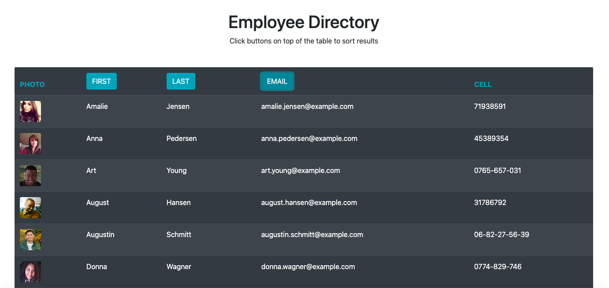

# Employee Directory
This app uses React to build an employee directory table with random employee data obtained from [RandomUser API]("https://randomuser.me/"). This data can be sorted by first name, last name, and email. In future development a search function will also be added.

* [deployed app]("https://lilicecilia23.github.io/employee-directory/")
* [GitHub Repository]("https://github.com/LiliCecilia23/employee-directory")

## Technologies Used
* React.js
* JavaScript
* BootStrap
* HTML
* CSS
  
## Usage Instructions
1. Go to [deployed app]("https://lilicecilia23.github.io/employee-directory/")
2. Random user data will be displayed automatically
3. To sort, click on the "FIRTST", "LAST", and/or "EMAIL" buttons on the top of the table

## License
Copyright 2020 Lili Clift Licensed under the MIT License.
